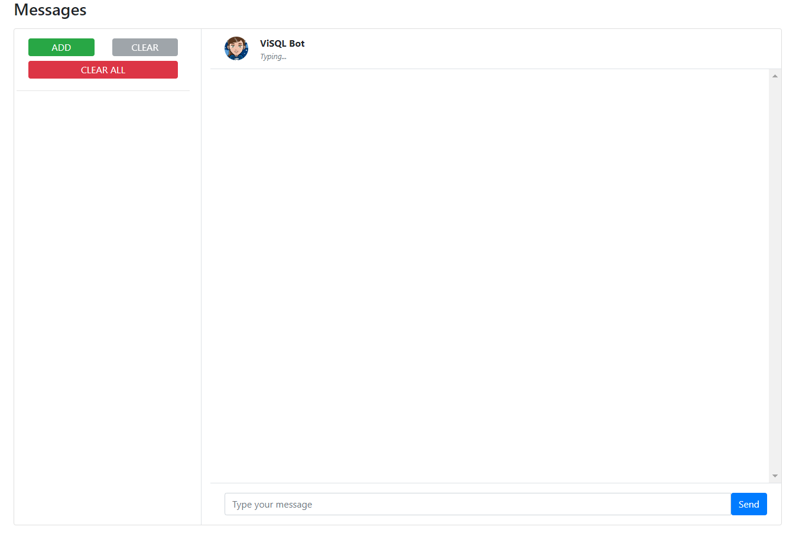
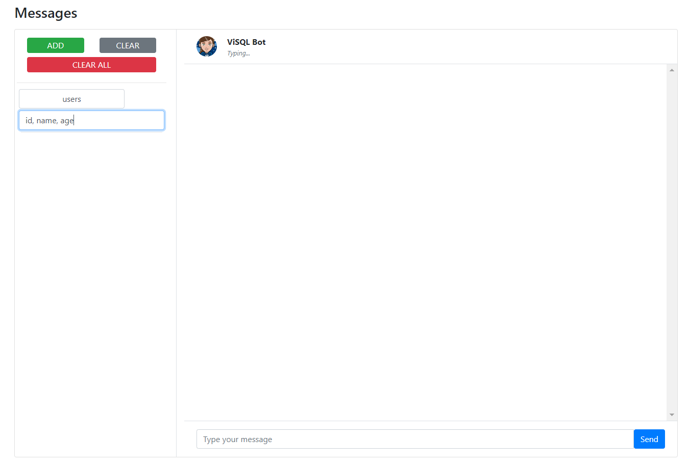
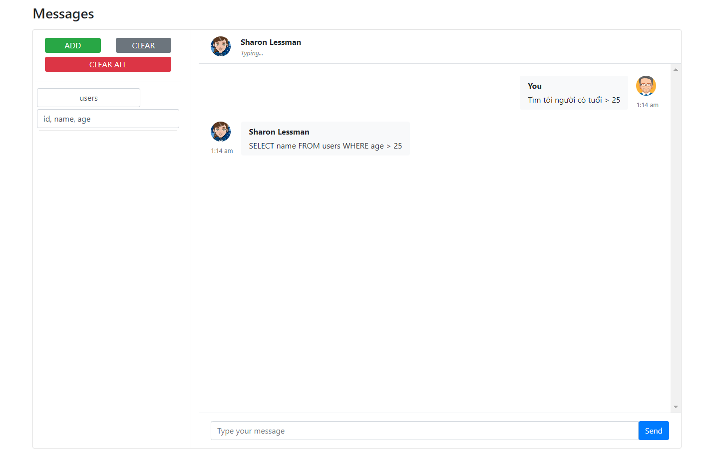

## Run Project
### Activate virtual environment
1. Create
```
python3 -m venv myvenv
```
2. Activate
```
source myvenv/bin/activate
```
### Install library
```
pip install -r /path/to/requirements.txt
```

### Download model
first you need to download our model from here:
You should save your dowloaded filer inside 'models' folder at the root of the project. 

### Run
```
cd path/manage.py
python manage.py runserver
```

## UI
When you first open project


Make sure you add table that you need to query in


Make your question and ask our bot

